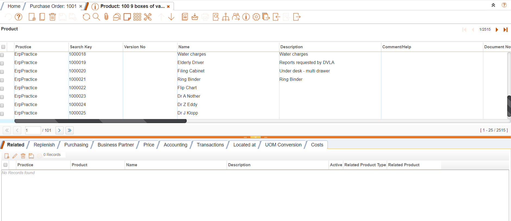
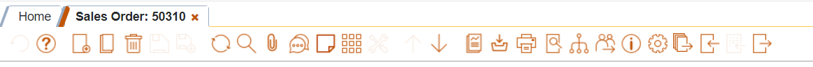

<h4 align="center">
		IDempiere Theme Plugin for change UI theme of idempiere
     
     

</h4>

 

## How to Install

### Pre-requisiites

- iDempiere 7.1

### IDempiere Theme Plugin
- Import theme plugin in eclipse
- Select theme plugin in server.product
- run attached sql file to update AD_SysConfig table value for ZK_THEME
- Restart server

## Sample Screen Shots

### Grid View

### Toolbar

### Attachment Popup

